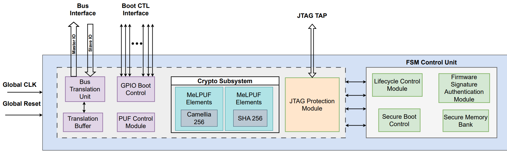

### MCSE Architecture

- MCSE Top  
  - Minimum Security Module  
    - SHA256  
    - CAM256  
    - GPIO  
    - PCM
    - AHB-Lite Interface
    - AHB-Lite Interface Translation Module
    - JTAG Protection Module
  - MCSE Control Unit
    - Life-cycle Protection Module
    - Secure Memory
    - Secure Boot Control 
    - Firmware Signature Authentication Module 



**MCSE/TA2 GPIO Pin Out**

| Pin | Direction | Functionality | Pin | Direction | Functionality |
|:--- | :---      |  :---         |:--- | :---      |  :---         | 
| 0   | Output    | Reset HOST Soc| 1   | Input     | HOST Reset ACK| 
| 2   | Output    | Halt HOST SoC | 3   | Input     | HOST Halt ACK | 
| 4   | Output    | Normal Operation Release to Host SoC | 5 | Input | Host Normal Operation ACK |
| 6   | Output    | HOST Bus Wakeup | 7 | Input | HOST Bus Wakeup ACK | 
|8    | Output    | IPID Address[0] |    |      |                     |
|9    | Output    | IPID Address[1] |    |      |                     |
|10   | Output    | IPID Address[2] |    |      |                     |
|11   | Output    | IPID Address[3] |    |      |                     |
|12   | Output    | IPID Trigger    |    |      |                     |
|     |           |                 |13  |Input | IPID Valid          | 
| 15  | Output    | FW Auth ACK     |14  |Input | FW Image Authentication Request | 
|     |           |                 |16  |Input | IPID In[0]          | 
|     |           |                 | ↓  | ↓    |      ↓              | 
|     |           |                 |31  |Input | IPID In[15]         |

### High-Level MCSE Life-cycle Functionality

Bullet points with an * are only completed at the first boot of each life-cycle. 

- Manufacture & Test
  - MCSE Initialization
  - Reset HOST Soc 
  - Golden ChipID Generation *
    - MCSE ID generation  
    - HOST bus wakeup
    - IP ID Extraction
    - Composite IP ID Generation
    - Golden Chip ID Generation
    - Store Golden Chip ID in memory
  - Update lifecycle
    - Transition lifecycle with life-cycle transition key (specific to each life-cycle)  
    - Reboot SoC
- Packaging & OEM
  - MCSE Initialization
  - Reset HOST Soc
  - Lifecycle Authentication (Authenticate current owner key, specific to each life-cycle) * 
  - Challenge Chip ID generation *
    - Generate Chip 
    - Fetch Golden Chip ID
    - Compare ChipID with Golden Chip ID
  - Normal operation release to HOST SoC
  - Firmware authentication (Work in progress)
  - Update lifecycle
    - Transition lifecycle with life-cycle transition key 
    - Reboot SoC
 - Deployment
   - MCSE Initialization
   - Reset HOST Soc
   - Lifecycle Authentication * 
   - Challenge Chip ID generation *
     - Generate Chip ID 
     - Fetch Golden Chip ID
     - Compare ChipID with Golden Chip ID
   - Normal operation release to HOST SoC
   - Update lifecycle
     - Transition lifecycle with life-cycle transition key 
     - Reboot SoC
 - Recall
   - MCSE Initialization
   - Reset HOST Soc
   - Lifecycle Authentication * 
   - Challenge Chip ID generation *
     - Generate Chip ID 
     - Fetch Golden Chip ID
     - Compare ChipID with Golden Chip ID
   - Normal operation release to HOST SoC
   - Update lifecycle
     - Transition lifecycle with life-cycle transition key 
     - Reboot SoC
 - End-of-Life
   - MCSE Initialization
   - Lifecycle Authentication *
   - Truncated boot sequence loop

### Simulation & Synthesis

Through the Makefile we are executing testbenches in VCS. 

The pre-synthesis testbench is "mcse_top_tb.sv". To run it use the command below (currently has to be run in the source_RTL directory but will be fixed) 
```
make MCSEtest
```
For synthesis using Synopsys DC, the compiledc.tcl file is used and will also produce the gate-level netlist file "mcse_netlist.v". Run the command below
```
make synthesis 
```
For a gate-level netlist simulation, the testbench is "mcse_top_netlist_tb.sv". Run the command below
```
make NETLISTtest
```

### HDL File Structure/Module Instantiations

- mcse_top.sv
  - min_security_module.sv  
    - sha_top.sv  
      - sha256_puf_256.v  
    - camellia_top.sv  
      - camellia.v
    - gpio.v
      - oh_dsync.v
      - packet2emesh.v
      - io.v
    - pcm.v
  - mcse_control_unit.sv
    - lifecycle_protection.sv
      - lc_memory.sv   
    - secure_memory.sv
    - secure_boot_control.sv
      
### HDL File Walkthrough

[mcse_top.sv](https://github.com/kshitij-r/AISS-Phase-III/blob/emmanuel/source_RTL/mcse_top.sv) is the top module for MCSE. The I/O contains the gpio_out, gpio_in, system-side AHB requester ports, and abstracted ports for lifecycle authentication/transitions which will later be done through the JTAG TAP ports. This module instantiates the minimum security module and the MCSE control unit. 

[min_security_module.sv](https://github.com/kshitij-r/AISS-Phase-III/blob/emmanuel/source_RTL/min_security_module.sv) contains the cryptographic accelerators (SHA256 and CAM256) for hashing and encryption/decryption. The GPIO module and PCM are instantiated here as well. Later, this will house the AHB-lite bus interface and JTAG protection module.

[lifecycle_protection.sv](https://github.com/kshitij-r/AISS-Phase-III/blob/emmanuel/source_RTL/lifecycle_protection.sv) file has the life-cycle protection module that holds the life-cycle state and handles requests for life-cycle transitions. This module also instantiates the memory in [lc_memory.sv](https://github.com/kshitij-r/AISS-Phase-III/blob/emmanuel/source_RTL/lc_memory.sv) (modeled as a read-only register file) which contains the keys to transition the life-cycle state for each life-cycle. 

[secure_memory](https://github.com/kshitij-r/AISS-Phase-III/blob/emmanuel/source_RTL/secure_memory.sv) file instantiates the secure memory modeled as a read and write register file. This memory will house the 2048 asset bits, life-cycle authentication keys, and anything miscellaneous MCSE needs to store. 

[secure_boot_control.sv](https://github.com/kshitij-r/AISS-Phase-III/blob/emmanuel/source_RTL/secure_boot_control.sv) file instantiates the secure boot control module which is the core of MCSE. This module is responsible for controlling all other modules in MCSE. Will handle the control flow for handshaking with TA2 (host SoC reset, system bus wakeup, IP ID Extraction, HOST normal operations release, FW authentication), life-cycle authentication and transition, and AHB-lite bus interface control. 

### Simulation & Synthesis File Walkthrough

[Makefile](https://github.com/kshitij-r/AISS-Phase-III/blob/emmanuel/source_RTL/Makefile) will clean the work and build environments for simulation and synthesis. All previously generated temporary files are removed such that any new run of simulation or synthesis is clean. Please refer above for the proper commands to execute each simulation and synthesis of MCSE. 

[mcse_top_tb.sv](https://github.com/kshitij-r/AISS-Phase-III/blob/emmanuel/source_RTL/mcse_top_tb.sv) is the pre-synthesis testbench. This simulation covers the first boot and subsequent boot functionality for each lifecycle state with descriptive output messages. Each task serves to test MCSE life-cycle specific functionality in a modular fashion. It is a behavioral simulation and walks through each life-cycle sequentially as if to cover all functionality throughout the chip's life. 

[compiledc.tcl](https://github.com/kshitij-r/AISS-Phase-III/blob/emmanuel/source_RTL/compiledc.tcl) is the Synopsys Design Compiler script to synthesize MCSE. The script allows DC to perform heavy optimizations to help reduce gate count. Once synthesis is finished, the script will display the netlist area, hierarchy, and references, and then output the gate-level netlist to a Verilog file which can then be used in post-synthesis simulation. 

[mcse_top_netlist_tb.sv](https://github.com/kshitij-r/AISS-Phase-III/blob/emmanuel/source_RTL/mcse_top_netlist_tb.sv) is the post-synthesis (gate level netlist) testbench. This simulation highlights the same functionalities as in the pre-synthesis simulation but doesn't have any output messages to show internal registers. This simulation shows first boot functionality for all life-cycles except in End of Life. The focus here is to show TA1/TA2 interactions are still functional post-synthesis. 


