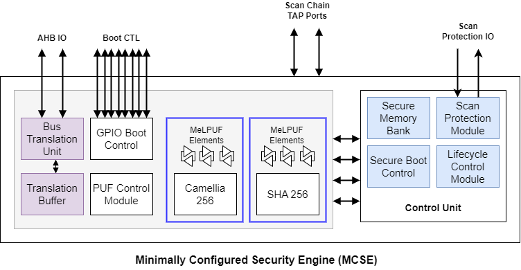

# University of Florida SENTRY for Minimally Configured Security (MCSE)
**This is a living document and subsequent changes are to be expected.**

## SENTRY for Minimum-Security Architecture

*Minimally-Configured Security Engine (MCSE) Architecture for Phase III*

# "RTL_config_100K" contains all the source files for 100K configuration for IV&V final release

## Current State of Development
In the final release, the following designs blocks are included:
 - Lifecycle management & control module
 - Boot control module via GPIO interface
 - SHA-256 with 256-bit MeLPUF elements
 - Camellia-256 256-bit MeLPUF elements
 - PUF Control Module for error correction of MeLPUF signatures
 - Scan Protection Module
 - Centralized FSM controller for managing orchestration of MCSE sub-blocks

## Repository Structure
The final release repository is structures as follows:
 - /sourceRTL: Contains design files for MCSE
 - /tb: Contains the top-level testbench for MCSE RTL simulation and makefiles to kick off tests.
 - /synthesis: Contains script for Synopsys DC MCSE design synthesis

Remark: Although the files are segmented into different folders, all simulation and synthesis are to be done from the /sourceRTL folder for the final release.

## Tool Requirements
The repository scripts and makefiles are designed to support RTL simulation and synthesis using the following EDA tools:
 - Synopsys VCS for RTL simulation
 - Synopsys Design Compiler for MCSE synthesis

## RTL Simulation
Current RTL setup supports the following features:
 - Extraction of MeLPUF signature from TA2 system and MCSE for the generation of ChipID
 - Handshake for TA2 system-bus wakeup and initialization
 - Chip lifecycle authentication during secure boot
 - Lifecycle transition and system-boot in updated lifecycle
 - Scan protection based on Vim-Scan protocol
 - ChipID authentication upon first boot at each lifecycle transition

To run the RTL simulation:
```
cd sourceRTL/
```

```
make MCSEtest
```

## Synthesis on GlobalFoundries GF12LPP Node
To sun synthesis of MCSE, a 'compiledc-GF12.tcl' script is provided. This script runs the synthesis on Synopsys Design Compiler using the GF12LPP library (sc9mcpp84_12lpplus_base_rvt_c14_ffpg_sigcmin_min_0p715v_125c.db
)

To run design synthesis:
```
 cd sourceRTL/
```

```
 make synthesis
```


## Remarks
 - The University of Florida team is making continuous updates to the design of each block in the MCSE. As a result, each block is subject to revisions, affecting its gate count and changes to the overall functionality.
 - This final MCSE delivery to IV&V has the design configuration that meets the DARPA metric of < 100K gate count with 2048 bits of asset size.

### Contact
For any issues or further information, please contact Tambiara Tabassum (tambiaratabassum@ufl.edu)                                     
